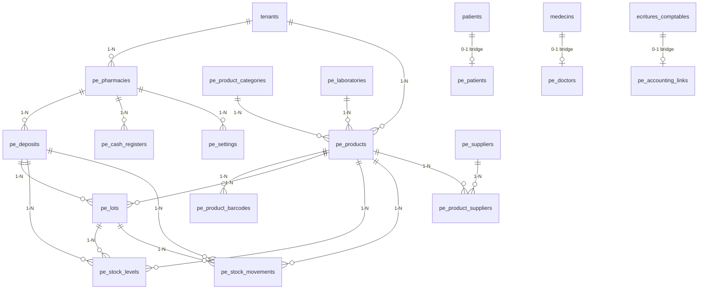

# PharmaPro ERP — Architecture & Intégration Efficasante

**Produit :** PharmaPro ERP (add-on premium)  
**Hôte :** Efficasante / Hopitaux (SaaS multi-tenant existant)  
**Feature flag :** `pharma_erp_suite`  
**Statut :** Bêta opérationnelle (POS, achats, SYSCOHADA, RH, API mobile, PDF)  
**Stack :** PHP 8.4 · MVC custom · MySQL 8 · Bootstrap 5.3 · ES2023 · PDO · PWA

---

## Étape 1 — Analyse du besoin

### Contexte

Efficasante dispose déjà d’un module `pharmacie/` orienté **HIS** (stock hospitalier basique : médicaments, mouvements, alertes).  
Le besoin exprimé est un **ERP pharmacie commercial complet** (concurrent WinPharma, Sage, Odoo Healthcare, Cegid, Pharmagest), vendu comme **produit indépendant** activé **uniquement par l’admin plateforme** pour les abonnés concernés.

### Objectifs métier

| Domaine | Besoin |
|---------|--------|
| Commercial | POS, scanner, tickets, facturation, promotions, fidélité |
| Stock | Lots, péremption, multi-dépôts, inventaires, ruptures |
| Achats | Fournisseurs, commandes, réceptions, dettes |
| Médical | Ordonnances, patients, médecins (lien HIS optionnel) |
| Finance | Comptabilité SYSCOHADA intégrée, écritures auto |
| Organisation | Multi-pharmacies, multi-caisses, multi-rôles |
| SaaS | Isolation tenant, audit, API REST, performance 500k+ produits |

### Périmètre d’activation

```
Admin plateforme → fonctionnalites.php
    → platform_tenant_features.feature_key = 'pharma_erp_suite'
    → enabled = 1 pour le tenant abonné

Tenant connecté → tenant_feature_enabled('pharma_erp_suite')
    → Accès dossier pharma_erp/
    → Sinon : redirection + message (module non activé)
```

### Coexistence avec le HIS

| Module | Rôle | Activation |
|--------|------|------------|
| `pharmacie/` | Stock hospitalier interne (existant) | Rôle `pharmacien` |
| `pharma_erp/` | ERP commercial premium | Feature `pharma_erp_suite` + rôles dédiés |

**Ponts optionnels** (Phase 2+) :
- Patients HIS ↔ `pe_patients.external_patient_id`
- Médecins HIS ↔ `pe_doctors.external_medecin_id`
- Ordonnances consultation ↔ `pe_prescriptions.external_consultation_id`
- Comptabilité HIS ↔ `pe_accounting_links.ecriture_comptable_id`

---

## Étape 2 — Architecture technique

### Structure des dossiers

```
Hopitaux/
├── pharma_erp/                    # Module ERP indépendant
│   ├── index.php                  # Dashboard PharmaPro
│   ├── pos/                       # Point de vente
│   ├── products/
│   ├── inventory/
│   ├── purchases/
│   ├── sales/
│   ├── accounting/
│   ├── settings/
│   └── api/                       # Endpoints AJAX internes
├── models/pharma_erp/             # Modèles PDO (TenantScope)
├── includes/pharma_erp/           # Bootstrap, guards, helpers, AccountingEngine
├── assets/css/pharma-erp/         # Design system PharmaPro
├── assets/js/pharma-erp/
├── config/sql/pharma_erp/         # Migrations SQL versionnées
└── api/rest/pharma/               # API REST v2 (future mobile)
```

### Couches MVC

```
Vue (Bootstrap 5.3 + Chart.js + DataTables + SweetAlert2)
    ↕ AJAX (fetch ES2023)
Contrôleur (pharma_erp/**/*.php — logique requête/réponse)
    ↕
Modèle (models/pharma_erp/*.php — PDO préparé, TenantScope)
    ↕
MySQL 8 (tables pe_* — préfixe Pharma ERP)
```

### Garde d’accès (obligatoire sur chaque page)

```php
require_once __DIR__ . '/../includes/init.php';
require_once __DIR__ . '/../includes/pharma_erp/bootstrap.php';
pharma_erp_require_feature();           // feature flag admin
pharma_erp_require_role('pharma_view'); // permissions granulaires
```

### Intégration SaaS existante

| Composant existant | Usage PharmaPro |
|--------------------|-----------------|
| `includes/init.php` | Session, Auth, TenantSchema |
| `TenantContext` / `TenantScope` | Isolation `tenant_id` |
| `PlatformTenantFeatures` | Flag `pharma_erp_suite` |
| `config/Auth.php` | Authentification partagée |
| `includes/module_guard.php` | Pattern `module_api_guard` |
| `comptes_comptables` / `ecritures_comptables` | Pont comptable SYSCOHADA |

### Design system

- Fichier racine : `assets/css/pharma-erp/pharma-pro.css`
- Variables CSS : bleu médical, vert pharmacie, turquoise, glassmorphism
- Layout dédié : `includes/pharma_erp/layout.php` (sidebar PharmaPro, dark/light)
- PWA : manifest + service worker scoped `/pharma_erp/`

### Performance

- Pagination server-side (DataTables AJAX)
- Index composites `(tenant_id, …)` sur toutes les tables
- Tables partitionnables : `pe_sale_lines`, `pe_stock_movements` (par année)
- Cache KPI dashboard (Redis optionnel Phase 3)
- Recherche produits : index FULLTEXT sur `pe_products.search_index`

### Sécurité

- CSRF sur tous les POST
- XSS : `htmlspecialchars` systématique
- Audit : `pe_audit_log` (action, user, IP, payload JSON)
- 2FA : réutilisation infrastructure Auth (Phase 2)
- API : JWT + scope tenant + rate limiting

---

## Étape 3 — Conception base de données

**Convention :** préfixe `pe_` (Pharma ERP), colonne `tenant_id` sur toutes les tables racine, soft delete `deleted_at` où pertinent.

### Domaines et tables (schéma complet)

#### A. Organisation (Phase 0)
- `pe_pharmacies` — sites / officines du tenant
- `pe_deposits` — dépôts / entrepôts
- `pe_cash_registers` — caisses POS
- `pe_settings` — paramètres clé/valeur par pharmacy

#### B. Référentiels (Phase 1)
- `pe_product_categories`
- `pe_laboratories`
- `pe_suppliers`
- `pe_products`
- `pe_product_barcodes`
- `pe_product_suppliers`

#### C. Stock & lots (Phase 1)
- `pe_lots`
- `pe_stock_levels` — (product, deposit, lot) → qty
- `pe_stock_movements` — entrées/sorties/ajustements
- `pe_inventories` / `pe_inventory_lines`

#### D. Ventes & POS (Phase 2)
- `pe_sales` / `pe_sale_lines`
- `pe_sale_payments` — espèces, mobile money, banque, mixte
- `pe_returns` / `pe_return_lines`
- `pe_promotions` / `pe_promotion_rules`
- `pe_loyalty_accounts` / `pe_loyalty_transactions`

#### E. Achats (Phase 2)
- `pe_purchase_orders` / `pe_purchase_order_lines`
- `pe_goods_receipts` / `pe_goods_receipt_lines`
- `pe_supplier_invoices`

#### F. Médical (Phase 2)
- `pe_patients` — lien optionnel `patients.id`
- `pe_doctors` — lien optionnel `medecins.id`
- `pe_prescriptions` / `pe_prescription_lines`

#### G. Comptabilité SYSCOHADA (Phase 3)
- `pe_accounting_plans` — plan comptable (clone/paramétrage SYSCOHADA)
- `pe_journals`
- `pe_journal_entries` / `pe_journal_entry_lines`
- `pe_bank_accounts` / `pe_bank_movements`
- `pe_bank_reconciliations`
- `pe_fixed_assets` / `pe_depreciation_schedules`
- `pe_vat_periods` / `pe_vat_lines`
- `pe_analytical_axes` / `pe_analytical_entries`
- `pe_accounting_links` — pont vers `ecritures_comptables`

#### H. RH (Phase 4)
- `pe_employees` — lien `personnel.id`
- `pe_payroll_runs` / `pe_payroll_lines`
- `pe_leave_requests`

#### I. Système (Phase 0)
- `pe_audit_log`
- `pe_document_sequences` — numérotation factures/tickets
- `pe_schema_migrations`

---

## Étape 4 — Relations entre tables

### Diagramme entité-relation (noyau Phase 0–1)



### Règles d’intégrité

1. **Tenant first** : toute FK métier inclut `tenant_id` dans index UNIQUE composites.
2. **Stock** : `pe_stock_levels.quantity >= 0` (CHECK ou trigger).
3. **Lots** : `expiry_date >= manufacturing_date`.
4. **Mouvements** : tout mouvement met à jour `pe_stock_levels` en transaction atomique.
5. **Ventes** : décrémentation stock FIFO/FEFO par lot configurable.
6. **Comptabilité** : chaque `pe_sales`, `pe_goods_receipts`, `pe_supplier_invoices` déclenche `AccountingEngine::post()`.
7. **Numérotation** : `pe_document_sequences` avec verrou `SELECT … FOR UPDATE`.

### Matrice d’activation

| Table | Créée à l’activation feature ? | Données demo |
|-------|----------------------------------|--------------|
| pe_pharmacies | Oui (auto-provision 1 officine) | Option admin |
| pe_products | Non (admin tenant importe) | Seed demo tenant |

---

## Étape 5 — Scripts SQL

Fichiers versionnés dans `config/sql/pharma_erp/` :

| Fichier | Contenu |
|---------|---------|
| `001_foundation.sql` | Organisation + audit + séquences |
| `002_products_stock.sql` | Produits, lots, stock |
| `003_sales_pos.sql` | Ventes, POS, paiements |
| `004_purchases.sql` | Achats, fournisseurs |
| `005_accounting_syscohada.sql` | Plan comptable, journaux, écritures |
| `006_medical_bridge.sql` | Patients, ordonnances, ponts HIS |

Exécution via `PharmaErpSchema::ensure()` (pattern `TenantSchema::ensure()`).

---

## Roadmap de développement (étapes 6–12)

| Sprint | Modules | Livrable |
|--------|---------|----------|
| S0 | Fondations | Feature flag, bootstrap, layout, migration 001 |
| S1 | Produits & stock | CRUD produits, lots, mouvements, alertes |
| S2 | POS | Vente, scanner, ticket thermique, paiements mixtes |
| S3 | Achats | Commandes, réceptions, fournisseurs |
| S4 | Comptabilité | SYSCOHADA, écritures auto, balance |
| S5 | Dashboard | KPI, Chart.js, widgets temps réel |
| S6 | API REST | `/api/rest/pharma/v1/` |
| S7 | RH & rapports | Salaires, congés, exports PDF |

---

## Rôles PharmaPro (extension `includes/roles.php`)

| Rôle | Code | Accès |
|------|------|-------|
| Gérant pharmacie | `pharma_manager` | Tout |
| Pharmacien | `pharmacien` | POS, stock, ordonnances |
| Caissier | `pharma_cashier` | POS uniquement |
| Comptable pharma | `pharma_accountant` | Comptabilité, rapports |
| Magasinier | `pharma_storekeeper` | Stock, inventaires, achats |

---

## Prochaine action recommandée

Valider ce document, puis enchaîner **Étape 6** : modèles PHP `PharmaErpSchema`, `PePharmacy`, `PeProduct`, `PeLot`, `PeStockLevel`.
